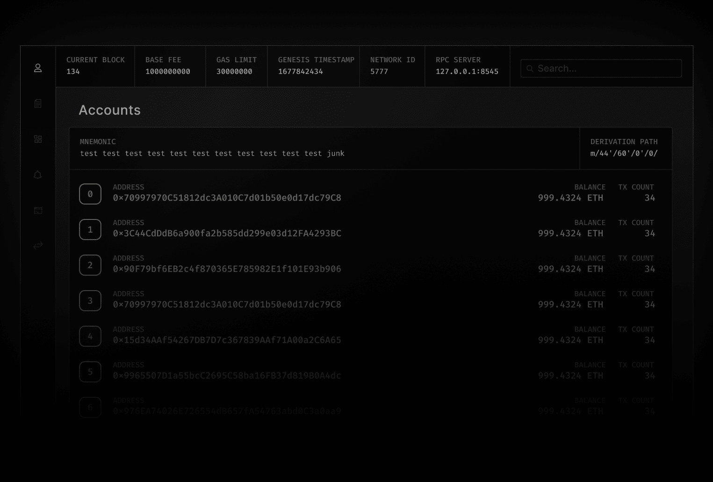

a GUI for [anvil](https://github.com/foundry-rs/foundry/blob/master/anvil)

Inspired by [Ganache UI](https://github.com/trufflesuite/ganache-ui)




⚠⚠ functional, but early WIP⚠⚠

to install latest from source: 
```sh 
git checkout dev
pnpm i
npx tauri build
```

---
## Todo: 
- [x] Anvil Log
- [x] Accounts (Basic)
- [x] Blocks (Basic)
- [x] Transactions (Basic)
- [ ] Test RPC calls (Impersonate, get tokens, rollback, mine, etc.)
- [ ] Setup GUI
- [ ] Save Environment
- [ ] Accounts
- [ ] Blocks
